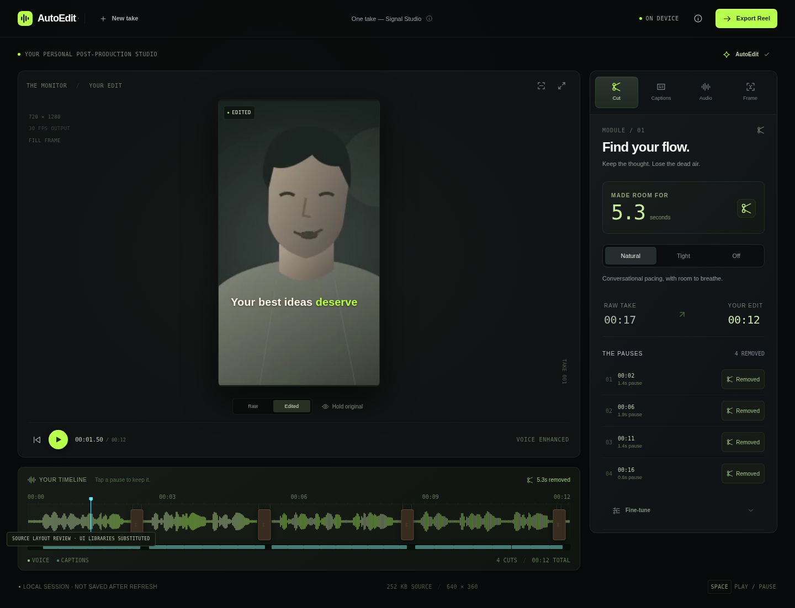

<p align="center"></p>
<h1 align="center">Creator AutoEdit</h1>
<p align="center"><strong>Turn raw talking footage into a polished short-form video — entirely in your browser.</strong></p>
<p align="center">CLIENT-SIDE &nbsp; / &nbsp; OPEN SOURCE &nbsp; / &nbsp; NO MEDIA UPLOADS &nbsp; / &nbsp; GITHUB PAGES</p>



**Release status: 0.9.0-rc.2 — browser-verified Pages preview candidate, not a production-certified release.** The installed dependency build, Vite build, Mediabunny H.264/AAC export, shipped UI import/export path, and Chromium model smoke paths have now been verified on Windows. WebKit codec-dependent exports, physical devices, thermal/memory behavior, network/privacy audit, license certification, and public deployment remain open; model output still needs creator review. Read [CURRENT_VERIFICATION.md](docs/CURRENT_VERIFICATION.md) for fresh evidence and [QA_REPORT.md](QA_REPORT.md) for the historical protocol. No live demo URL has been fabricated.

The image above is an isolated layout preview using an actual decoded bundled video, real waveform analysis and the shared Canvas renderer. It remains a design-review screenshot; the fresh built-app screenshots and downloaded MP4s are in [current evidence](docs/current-evidence/README.md). Caption timings in layout screenshots are explicit fixture timings, not reported Whisper output.

## A little studio. All yours.

One take, four modules, one finished file. Creator AutoEdit is intentionally focused on single-person English talking-head clips, not multi-track editing. The default edit is Natural pacing, Clean captions, Voice Enhance with light noise reduction, and vertical framing. Automatic results remain editable.

| Module | Implemented source path |
|---|---|
| **Cut** | Energy-based pause detection, Natural/Tight/Off pacing, speech padding, individual pause restoration, compressed waveform timeline |
| **Captions** | Local Whisper worker, timestamped words, editable phrases, five styles, three deterministic animations, type/colour/placement controls |
| **Audio** | RNNoise worker, high-pass filtering, gentle compression, level control, peak limiting, same-position original/enhanced preview |
| **Frame** | 9:16 / square / original, face trajectory smoothing, drag/pinch crop, Fill / Blur / Fit fallbacks |
| **Export** | Shared edit clock, burned Canvas captions, source-time framing, sample-accurate audio, H.264/AAC MP4, real progress and cancellation |

A capability check runs before ingest. The rest is lazy-loaded. There is no account, backend, database, processing endpoint, analytics or session replay.

### The studio interface

Layered graphite panels. Signal-green controls. Electric-cyan caption timing. Waveform compression, spring-timed numbers, a subject viewport and an export-layer merge. The mobile workspace is a video monitor, timeline and four-module bottom rail; desktop gets a real preview/property workspace. Reduced motion is respected. See [all 25 screens](docs/screenshots/index.html), [mobile editor](docs/screenshots/18-editor-mobile.png), [captions](docs/screenshots/05-captions-desktop.png), [audio](docs/screenshots/07-audio-desktop.png), and [framing](docs/screenshots/09-frame-desktop.png).

Accessible primitives follow shadcn/Radix conventions and are fully themed. Number ticks and signal borders adapt the interaction ideas of Magic UI; upload and restrained pointer glow are original Aceternity-inspired implementations. No paid Aceternity source or stock component demo page is included.

## Privacy, precisely

> Your video stays on your device. Editing and transcription happen locally in your browser.

Creator AutoEdit downloads the processing code and speech models required to edit your video, but your source video, audio, transcript and exported video are not uploaded by the application.

Application files come from your static host. Speech-model files come from Hugging Face. Face-model files come from Google's model hosting. Those services receive ordinary asset requests, including normal network metadata. **“Local processing” does not mean there are no network requests.**

Source media and projects are never written to localStorage, IndexedDB or Cache Storage. A refresh loses the project. Only a dedicated speech-model cache is retained; **About → Clear models** removes that cache and cancels active caption work. No service worker is installed. Browser HTTP caches are managed by the browser, not cleared globally by the application.

MediaPipe runs in a worker whose fetch/XHR transports allow only expected asset URLs. Other exposed telemetry transports are disabled. This is defense in depth, not a completed network-security audit: a real worker/SDK network capture remains a release gate. See [SECURITY.md](SECURITY.md).

## Architecture

```text
FILE / BLOB — never a media upload
 │
 ├── Mediabunny ───── metadata / demux / decode
 │
 ├── Audio worker ── 48 kHz mono ── waveform / pause detection
 │                     │
 │                     ├── 16 kHz → Whisper → SOURCE-time words
 │                     └── RNNoise → voice DSP → SOURCE-time audio
 │
 ├── Frame samples ── MediaPipe → smoothed SOURCE-time subject path
 │
 └── ONE EDIT DECISION LIST
              │
              └── OUTPUT clock ↔ SOURCE clock
                         │
                    Shared renderer
                         ├── crop / fit / blur / subtle punch
                         ├── measured, animated caption pixels
                         ├── exact audio intersections / crossfades
                         └── H.264 + AAC → MP4
```

Processing code is separate from presentation. `src/app/store.ts` holds one explicit project state, while audio buffers live outside React snapshots. `Jobs` owns cancellation. Each worker is terminated when its job ends, is superseded, or is cancelled. Inputs stay File-backed, decoded samples are closed, decode canvases are pooled, and object URLs are revoked when the project is replaced.

### One clock, no accumulated cut drift

`EditMap` merges and validates half-open keep ranges. Source time is canonical for words and face samples. Preview, timeline, renderer and export all use the same source/output mapping. A CFR 30 fps export clock asks the EDL for each source timestamp; it never independently rounds every keep-range duration to a frame count.

Audio is placed on a 48 kHz source clock, not concatenated according to decoder callback order. A continuous, timestamp-aware resampler carries interpolation/filter history across decoded packets, handles negative priming and real gaps, and does not restart its filter phase at each packet. Export intersects that source clock with the same EDL. A 4 ms linear blend centered on internal seams borrows adjacent source handles without shortening the edited timeline. Start/end trimming gets short ramps. Tests check seams and arbitrary block partitioning; audible quality and real-device lip sync still require integration acceptance.

### Pause removal

20 ms RMS windows, a percentile noise floor, speech/noise contrast, a hysteresis band and minimum pause lengths distinguish dead air from quiet speech. Natural keeps about 190 ms of speech-edge padding; Tight keeps about 110 ms. The algorithm is not semantic filler-word removal and does not claim to identify “um” or “uh.” Speech/music/noise mixtures remain harder than a single speaking voice.

### Transcription

`@huggingface/transformers` is imported only when captions are requested. `Xenova/whisper-tiny.en` is the English ONNX model selected here, pinned to immutable revision `79fb389fc764e7c395bd330e9531d9d32ada7049`. Its model card documents Transformers.js word-level timestamps and declares Apache-2.0; the upstream Whisper project is MIT-licensed. CPU/WASM q8 is the supported caption path in this release, with no WebGPU capability claim. The runtime remains single-threaded and does not require `SharedArrayBuffer` or cross-origin isolation.

Audio is mono 16 kHz. Long clips are processed in 24-second ownership windows with 2-second context overlaps. Words are deduplicated by ownership interval, keep source timestamps, and get regrouped into short phrases. Editing one phrase preserves original timings when the word count matches; larger changes interpolate inside the existing phrase interval. Whisper accuracy and word timing are not guaranteed: creators must review the result.

Progress reports actual asset bytes or processed chunks. Worker termination is the practical cancellation mechanism during inference. The selected model/runtime pairing has not yet completed an inference smoke test in this environment.

### Voice and framing

RNNoise processes 480-sample frames at 48 kHz with explicit amplitude conversion. Light mixes denoised and original signals; Strong uses the denoised result. If RNNoise fails, a visible warning leaves a real high-pass/compression/normalization chain available. This is voice cleanup, not studio reconstruction, de-reverberation or loudness-certified mastering. The RNNoise delay assumption needs an impulse/lip-sync acceptance measurement.

Face samples are taken at about 2 Hz on a small decode surface. Confidence gating, a dead zone, smoothed velocity/acceleration and hold behavior prevent a twitchy crop. Face detection failure leaves centered/manual framing available. Face positions are queried in source time; no separate tracking offset accumulates after cuts.

### Export

Mediabunny decodes frames at the EDL-selected source times. Canvas draws source crop, fitted/blurred background, punch and animated captions. The same renderer draws preview. Output is 30 fps H.264; audio is AAC when present. Native AAC is tested and the official `@mediabunny/aac-encoder` extension is lazily registered only when needed. It contains a small FFmpeg-derived AAC codec, **not** ffmpeg.wasm or a server transcoder.

A paged random-access target supports MP4 header rewrites and bounds memory growth. Encoding progress uses completed frame counts; final muxing and verification are indeterminate when their APIs do not expose progress. The final file is re-opened and checked for expected AVC/AAC tracks, dimensions, track start/end times and duration before being offered to save. Three small frames are decoded from the encoded MP4 as a further integrity check. This integrity check is not a replacement for listening to and playing a real export.

## Browser and media envelope

The app probes codec support rather than trusting a browser name. A recent browser with working WebCodecs H.264 encoding is needed; lack of native AAC encoding can use the official fallback. Safari/iOS compatibility is **unverified**, not a claimed support matrix.

One video per project; roughly five minutes maximum and under three minutes recommended. Mobile file limit: 350 MiB; desktop: 1 GiB. SDR MP4/MOV/WebM are accepted only when actual codecs decode. HDR is deliberately rejected until reliable tone mapping is tested, which means some normal iPhone recordings need an SDR copy. Input decode through 4K is hardware-dependent, not certified here. Export is 720×1280 or 1080×1920 for vertical; square/original dimensions are derived from those presets. No 4K output option is exposed.

Output is mono voice audio. Music, multi-speaker diarization, arbitrary codecs, HDR, persistent projects, background-tab processing and direct Instagram posting are outside this build. A constrained device defaults to 720p. Export buffers are capped; long/high-quality mobile exports may need a shorter clip or Standard quality.

## Local development

Use Node 22.12 or later and an internet-enabled package manager:

```sh
npm ci
npm run dev
```

The development site uses `/creator-autoedit/`. `prepare:assets` resolves the installed Transformers.js copy of ONNX Runtime and the installed MediaPipe package, then copies matching WASM/glue files under the same-origin base path. It also writes a hash/version manifest and collects installed package license notices. It does not download or copy user media.

```sh
npm run lint
npm run typecheck
npm test
npm run build
npm run preview
```

`BASE_PATH=/your-repository/` controls Vite's production base. Set `VITE_REPOSITORY_URL` to the real repository URL for development/custom domains. On a GitHub project page the app can infer the source link from the hostname and path. No server routes, SSR or server functions are used.

## Tests

```sh
npm test                         # Vitest pure algorithm suite
npx playwright install chromium webkit
npm run test:e2e                 # Actual browser fixture/export integration
npm run test:production          # Built-site subpath and shipped-UI export tests
npm run test:models              # Separate actual Whisper/RNNoise/face inference
npx playwright test --config playwright.models.production.config.ts --project=chromium # Model smoke under built CSP
npm run test:source:offline      # Limited pure-source types and TS/TSX syntax
npm run test:core:offline        # Alternate native assertion runner, not Vitest
npm run verify:release          # Fails until all release gates have evidence
```

The unit suite currently passes **135 tests in 15 files**. They cover EDL endpoints/adjacency/many cuts and thousands of round-trips, silence/noise/quiet speech, caption regrouping/correction/safe zones, crop dragging, packet-continuous resampling, audio seams, stale-result protection, worker cancellation, model-cache failure, export integrity, bounded output storage and the face-worker asset allowlist. The alternate offline runner remains available; its result is separate from the Vitest and browser reports.

Playwright has Chromium and WebKit projects and real tiny MP4/no-audio fixtures. Its test-only entry invokes the actual audio-analysis worker and exporter; it pre-seeds caption timings only for UI tests to avoid model downloads in ordinary CI. It verifies tracks, dimensions, durations, timestamp order, sampled frame brightness and HTML video playback. The current Windows run passed 5/5 development Chromium tests, 4/4 built-site Chromium tests, and the built-site with-audio/no-audio downloads were checked with ffprobe. WebKit reported codec-dependent skips where its probe could not encode; those skips are explicitly not device acceptance. The separate Chromium model suite passed actual RNNoise, Whisper CPU/q8, and MediaPipe checks, including the built app's production-CSP worker/runtime smoke. The model result has a known speech recognition error in one phrase and still needs review; no canned inference outputs are used.


### What changed in RC2

The resampler now maintains filter history across decoder packets. Stale face/voice results cannot overwrite newer manual settings, worker failures terminate their jobs, caption model caching tolerates quota/private-mode errors, and export validation checks codec and track timing before attempting real frame decode. Manual crop gestures use the actual source/view geometry instead of a fixed drag factor. Technical readouts are more legible on desktop and phone. See [CHANGELOG.md](CHANGELOG.md).

The updated source also passed **21 isolated UI/Canvas/native-preview checks**: caption correction preserved timing, presets changed renderer inputs, three frame modes produced different Canvas pixels, manual crop moved, and native cut-aware playback skipped a real pause while Raw comparison did not. These tests used substituted presentation dependencies. They do not prove actual Radix accessibility, Motion behavior, ML inference, or MP4 export.

## Demo media

[Play the bundled illustrated demo](public/demo/one-take.mp4).

`public/demo/one-take.mp4` is a 17.5-second, ~252 KiB original illustrated speaker with synthetic speech, quiet room-noise simulation and intentional gaps. **Try demo** processes this actual file; it does not substitute a canned transcript or finished export. It is labeled illustrated/synthetic in the interface and does not satisfy the real-person demo requirement. Replace it with rights-cleared talking-head footage before release.

`tests/fixtures/` includes smaller codec fixtures. `scripts/generate-fixtures.py` recreates these development assets using Pillow, CairoSVG, NumPy, eSpeak and native FFmpeg. None of those native tools ship in the application.

## GitHub Pages deployment

Select **GitHub Actions** as the Pages source. The supplied workflow installs the reviewed lockfile with `npm ci`, lints, typechecks, runs unit tests, builds under the exact repository subpath, runs Chromium/WebKit development and built-site tests, uploads review artifacts, and deploys a browser-verified Pages preview only after the mandatory Chromium production checks pass. User/organization `*.github.io` repositories automatically use `/`; project repositories use `/<repository>/`.

A reviewed, committed lockfile is required for the workflow. `npm run verify:release` remains the separate full-certification check: it still requires explicit model/runtime, physical-device, network/privacy, license, and real talking-head evidence. Keep `RELEASE_GATES.json` truthful and fill it only with evidence from those checks. A Pages preview that passes the automated browser gate must still be described as a preview until the full certification record is complete.

There is no deployed URL in this delivery because no remote publication was requested. The workflow is ready to publish from the repository once Pages is enabled; no URL is implied by these local checks.

## Release checklist, contributing and licensing

[QA_REPORT.md](QA_REPORT.md) contains observed results, untested behavior and the complete physical-device acceptance protocol. [CONTRIBUTING.md](CONTRIBUTING.md) covers changes and review. [SECURITY.md](SECURITY.md) describes the privacy boundary. [THIRD_PARTY_NOTICES.md](THIRD_PARTY_NOTICES.md) distinguishes original code, dependency terms, model terms and outstanding binary/license obligations.

Original application code and original demo artwork/text are MIT-licensed. Third-party libraries, model weights, runtime binaries and fonts retain their own licenses; this project's MIT license does not replace those terms.

### Next release work

Close the model/runtime smoke gates; validate the full 60–90-second iPhone, Android, desktop Safari workflow and phone thermals; audit worker network traffic; replace the illustrated demo; complete exact-version license provenance; then publish and verify the project-page build. After that: carefully scoped HDR tone mapping, better VAD and optional explicit local project saving. Reliability precedes new features.
