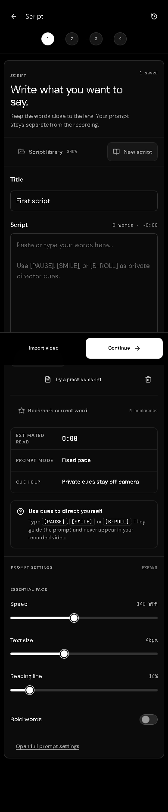

# Creator AutoEdit

Creator AutoEdit is a private browser studio for turning one talking-video take
into a reviewable short-form edit. Its primary flow is **Script → Record →
Review → Edit → Export**. The default path opens on Script, requests camera and
microphone only after Continue, records a native portrait or landscape take,
opens immediate review, then carries the selected take into the editor.



## What it does

- Script library with local autosave, search, bookmarks, TXT/Markdown/DOCX
  import, backup, cue text, and keyboard-friendly prompt controls.
- Full-screen camera recording with native `getUserMedia` and
  `MediaRecorder`; the prompt is a separate overlay and never enters source
  bytes.
- Durable take manifests and ordered IndexedDB chunks, immediate playable
  review, retakes, favourites, comparisons, original/recovery downloads, and
  editor handoff.
- Deterministic audio-gate AutoCut with conservative speech-onset handles,
  per-cut Keep/Remove controls, and adjustable before/after handles.
- Framing, original-audio preservation with short cut-seam ramps, and shared
  preview/export rendering when the browser exposes the needed codecs.

No local AI, ML, speech recognition, voice-follow, model download, analytics,
or cloud processing path is shipped. The editor preserves original audio;
there is no voice-enhancement feature.

## Run it

Use Node 22.12 or later:

```sh
npm ci
npm run dev
```

Open `http://127.0.0.1:5173/creator-autoedit/`.

```sh
npm run lint
npm run typecheck
npm test
npm run build
npx playwright install chromium
npm run test:e2e
npm run test:production
```

The build emits a repository-scoped offline shell. It caches generated app
assets only; IndexedDB manifests/chunks and user downloads remain outside
Cache Storage. `npm run prepare:assets` writes only package notices and an
empty runtime diagnostic manifest because no model runtime is included.

## Verification and provenance

- [Phone-flow verification](docs/TELEPROMPTER_VERIFICATION.md)
- [Feature matrix](docs/TELEPROMPTER_FEATURES.md)
- [Phone-flow evidence](docs/phone-flow-evidence/)
- [Origin UI source notes](docs/SOURCES_ORIGIN_UI.md)
- [Third-party notices](THIRD_PARTY_NOTICES.md)
- [Security boundary](SECURITY.md)
- [Historical QA protocol](QA_REPORT.md)

Origin UI NG is an Angular project. This app adapts its component anatomy,
focus states, sizing, and black/white tokens into React wrappers backed by the
installed Radix React primitives. The exact upstream commit and source paths
are recorded in [docs/SOURCES_ORIGIN_UI.md](docs/SOURCES_ORIGIN_UI.md).

## Privacy and limits

Selected video, camera recordings, scripts, and edit state stay on this device.
There is no backend, account, analytics, or source-media upload endpoint. A
user-initiated download intentionally leaves the browser. Storage eviction and
a browser crash can lose an unflushed recording tail; absolute crash recovery
is unavailable.

Current browser evidence is controlled Chromium on Windows. Physical iPhone,
Android, and macOS camera behavior, long recordings, thermal behavior, and
browser-specific camera controls remain untested. Teeth enhancement and a
browser thermal sensor are unsupported. A passing browser preview is not a
production certification; consult [RELEASE_GATES.json](RELEASE_GATES.json) and
[QA_REPORT.md](QA_REPORT.md) for release requirements.
